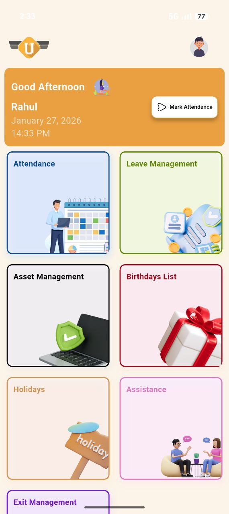
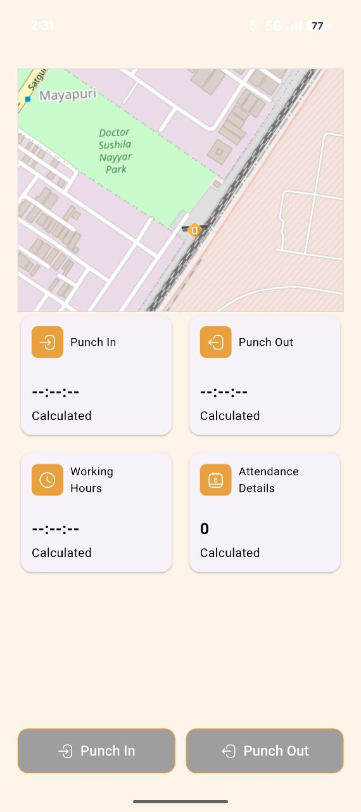
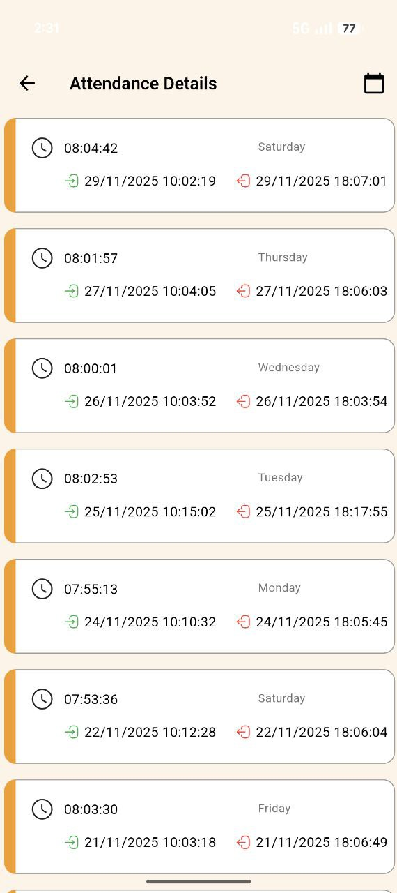
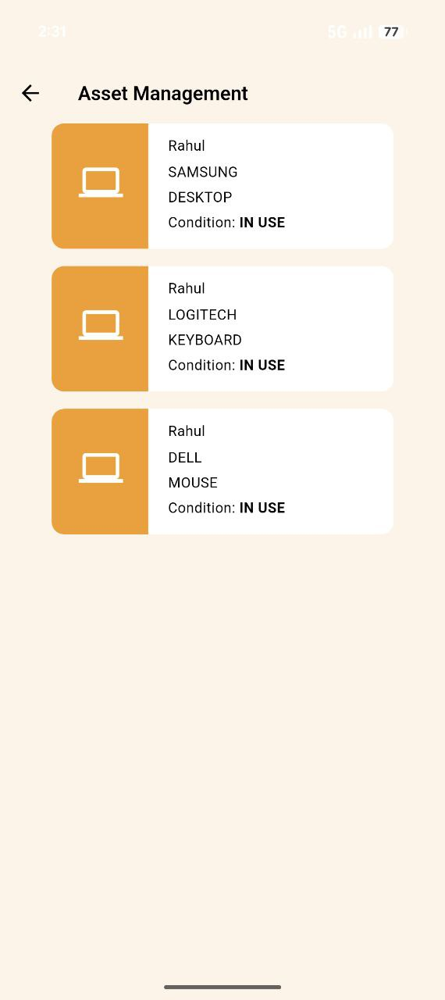
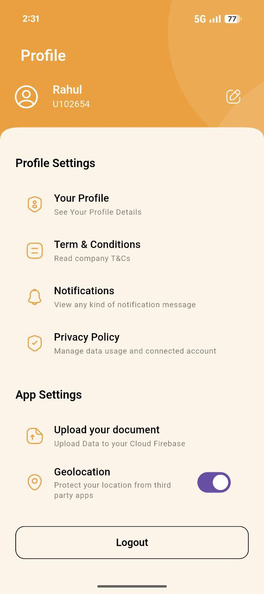

# 🧑‍💼 HR Management System  
### Geofence-Based Attendance & Workforce Management

A **production-ready HR Management mobile application** built using **Flutter** with **GetX state management**, designed to manage employee attendance, leave, assets, and internal notifications across multiple office locations.

The application focuses on **attendance integrity**, **anti-GPS spoofing security**, and **single-device access control**, making it suitable for real-world organizational use.

---

## 📱 App Overview

This application allows organizations to:
- Track employee attendance using **geofencing**
- Prevent fake location punch-ins
- Restrict account usage to **one device**
- Manage assets, leaves, and notifications
- Automate HR workflows securely

---

## 🎥 App Demo

  <video src="https://github.com/rahulkashyap7/HRMS-Application/blob/main/screenshots/app_overview.mp4?raw=true" width="400" controls>
    Your browser does not support the video tag.
  </video>

---
## 🧪 App Testing (APK)

📥 **Download APK:**  
👉 **(https://drive.google.com/file/d/1jDuOnY9XyIdWsNkOPm1CA8HHfQd4kJdH/view?usp=sharing)**

> ⚠️ Enable “Install from unknown sources” if prompted.

## 🚀 Key Features

### 📍 Geofence-Based Attendance
- Employees can **Punch In / Punch Out** only when inside the office geofence.
- Live map shows employee location relative to office boundary.
- Supports **multiple branch offices** (Delhi, Gurgaon).

### 🛡️ Anti GPS Mocking & Developer Mode Blocking
- The app **detects if Developer Options are enabled**.
- Since GPS spoofing apps require developer mode:
  - If **Developer Mode is ON**, the app **blocks access**.
- Prevents:
  - Fake GPS apps
  - Location bouncing
  - Remote punch-ins

> ⚠️ App will not function until Developer Mode is disabled.

### 📱 Device Binding & Remapping Security
- Each user account is **bound to a single device**.
- If login is attempted from another device:
  - User sees a popup:
    > *“This device is already registered. Please contact HR to remap your device.”*
- Device remapping can only be done by HR/admin.

This prevents:
- Credential sharing
- Multi-device misuse
- Unauthorized access

### ⏱️ Attendance Tracking & History
- Punch-in & punch-out timestamps
- Automatic working hours calculation
- Date-wise attendance history

### 🧾 Asset Management
- Assign assets (Laptop, Keyboard, Mouse) to employees
- Track asset status (IN USE)
- Centralized asset visibility for HR

### 🏖️ Leave Management
- Apply for leaves directly from the app
- HR approval workflow
- Leave history per employee

### 🔔 Push Notifications (FCM)
- Implemented using **Firebase Cloud Messaging (FCM)**
- Notifications for:
  - Birthdays
  - Holidays
  - Company announcements
  - HR alerts

---

## 📸 App Screenshots

### Dashboard

### Attendance & Geofence Map

### Attendance History

### Asset Management

### Profile & Settings

---

## 🧱 Tech Stack

### 📱 Frontend
- Flutter
- GetX (State Management, Routing, Dependency Injection)

### 🖥️ Backend
- Node.js + Express
- Hosted on **AWS EC2**

### 🗄️ Database
- PostgreSQL (Neon Console)

### 🔐 Services
- Firebase Cloud Messaging (FCM)
- REST APIs
- GPS & Geolocation Services

---

## 🔑 Test Credentials

### 👤 Employee Login
 - ID: rahul@uflindia.in
 - Password: U102654